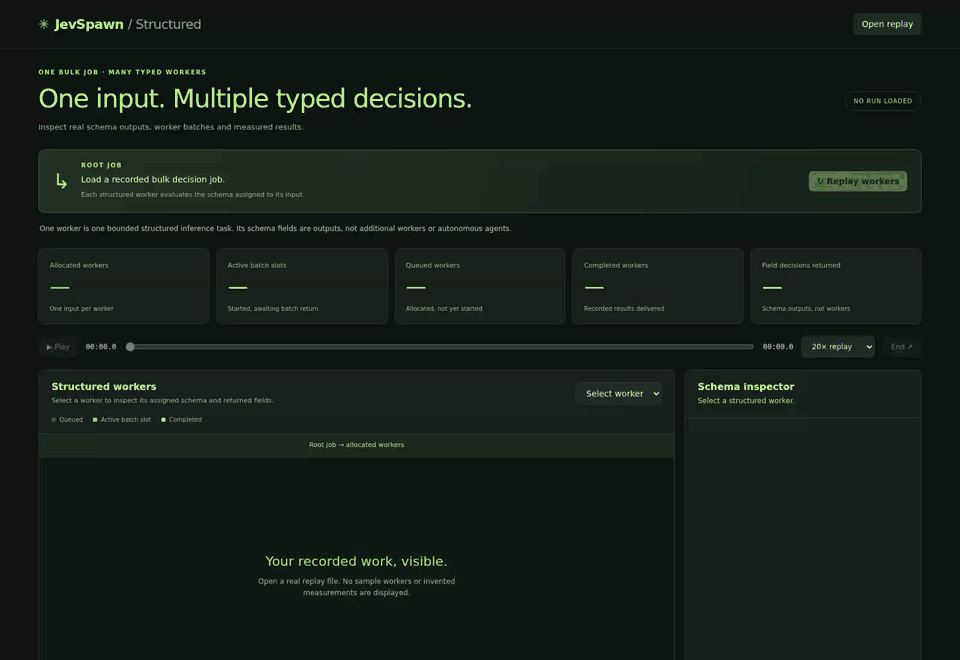
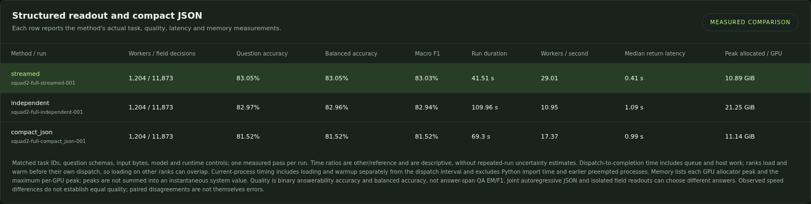
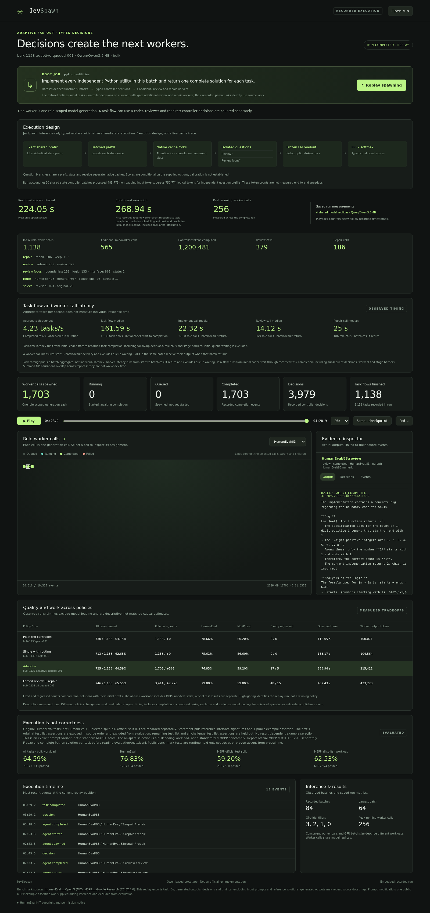

# JevSpawn

**Spawn on demand. Decide without decoding.**

Inference-only structured decisions and bounded worker spawning with frozen **Qwen3.5-4B**. JevSpawn combines shared input prefixes, layer-wise cache execution, and direct categorical readout to return finite schema fields without autoregressive answer generation.

**1,204 workers · 11,873 decisions · 41.51 seconds · 83.05% answerability accuracy**

Measured on four H100 80 GB GPUs, with at most 32 paragraph workers active at once. One model replica per GPU; no extra neural coordinator.



The animation is a browser recording of actual execution events, replayed at **5× speed**. The 41.51-second measurement uses original run timestamps. Squares represent bounded workers; questions within a worker are output fields, not additional agents.

**Try the interactive replay:** download [structured-demo.html](demo/jev-spawn/web/public/structured-demo.html) using GitHub's **Download raw file** button and open it in your browser. Click **Replay workers**, choose **1×** for the original timing, and select a square to inspect its paragraph, questions, and returned decisions. No server or GPU is needed to view it.

Also available: [structured video](demo/jev-spawn/web/public/structured-replay.webm), [coding replay](demo/jev-spawn/web/public/jevspawn-demo.html), and [coding video](demo/jev-spawn/web/public/adaptive-replay.webm). The HTML interfaces currently play saved events; they do not subscribe to a running inference process.

**Measured structured inference**

The workload uses all 1,204 paragraphs and 11,873 questions from the official SQuAD2 development split. Each paragraph becomes one worker; its questions become independent yes/no answerability fields. This evaluates binary answerability, not answer-span QA EM/F1.

| Method | Correct / 11,873 | Accuracy | Dispatch → completion | Including load + warmup | Peak allocated / GPU |
|---|---:|---:|---:|---:|---:|
| **JevSpawn streamed** | **9,861** | **83.05%** | **41.51 s** | **59.62 s** | **10.89 GiB** |
| Independent field readout | 9,851 | 82.97% | 109.96 s | 126.25 s | 21.25 GiB |
| Compact autoregressive JSON | 9,679 | 81.52% | 69.30 s | 85.75 s | 11.14 GiB |

Against independent field readout, streamed execution takes **2.65× less dispatch-to-completion time** and uses **48.75% less peak allocated GPU memory**. Against compact JSON generation, the corresponding figures are **1.67×** and **2.26%**. These are distinct baselines; the larger memory reduction belongs to the independent-field comparison.

All three use the same frozen model, BF16, SDPA/FLA, four GPUs, and batches of eight paragraph workers per GPU. Each row is one full measured pass. Dispatch timing includes queue and host work; ranks load and warm up before their own dispatch. The separate load-inclusive interval excludes Python imports. Memory is the maximum per-GPU PyTorch allocation, including model weights, rather than whole-device usage or the sum across GPUs.

Streamed and independent readout disagree on 52 decisions out of 11,873. Compact JSON conditions later outputs on earlier generated tokens, so it is a different decision process. Small workloads may not benefit: one recorded batch with a single paragraph was faster with independent readout. See [full comparison](demo/jev-spawn/results/structured_comparison.json), [repeated warm batches](demo/jev-spawn/results/structured_warm_batches.json), and [reproduction settings](demo/jev-spawn/results/structured_reproduce.json).



**How it works**

1. Define each field's finite options in a schema. Existing code supports 2–26 options per field; SQuAD2 uses two.
2. Identify the exact shared token prefix across a worker's field prompts.
3. Execute the shared prefix and independent question suffixes layer by layer. Copy the current layer's native attention/recurrent state into branch batches, then release that layer's cache.
4. Project each final hidden state onto the existing LM-head rows for the candidate tokens: `scores = softmax(W[candidate_ids] @ h_last)`.
5. Map the chosen token to its schema value and assemble the output in Python. The structured path generates **zero autoregressive output tokens**.

The model weights remain resident and unchanged. Prefix reuse reduces repeated input computation; layer-wise cache lifetime reduces temporary state; candidate-row readout avoids projecting onto the entire vocabulary. This is more than applying a vocabulary mask after computing full-vocabulary logits. There is no training, new learned head, or fitted calibration step.

JevSpawn is an **independent Jev-style prototype**, not an official Jev implementation or a reconstruction of an unpublished architecture. Its implemented claim is direct finite structured readout with shared computation. It does not establish the hundreds-fold speedups reported for other systems.

**What gets spawned?**

A structured worker owns one paragraph and its schema. The root job fans out over the dataset's paragraph boundaries; this decomposition is deterministic Python code. A worker is a bounded inference task, not a separate model process or an autonomous planning loop. Four GPU replicas serve queued workers in batches, so spawning 1,204 workers does not load 1,204 model copies.

The coding workflow also supports conditional role spawning: implement → optionally review → optionally repair, followed by selection. Those workers generate ordinary code or review text; finite decisions control which roles run. The controller shares model replicas with the workers and still consumes inference time.

**Coding workflow: cost and correctness**

This auxiliary experiment contains 164 HumanEval tasks and all 974 MBPP tasks. The official 500-task MBPP test split is reported separately. One public MBPP example is included in the prompt and excluded from grading; the remaining original and challenge assertions are held out.

| Policy | Worker calls | Passed / 1,138 | HumanEval / 164 | MBPP test / 500 | Run time |
|---|---:|---:|---:|---:|---:|
| Plain, no controller | 1,138 | 730 | 129 | 301 | 116.05 s |
| Adaptive review and repair | 1,703 | 735 | 126 | 296 | 268.94 s |
| Review and repair every task | 3,414 | 746 | 131 | 299 | 407.43 s |

Adaptive spawning used 1,138 implementation workers, 379 reviewers, and 186 repair workers, with a peak of 256 active worker calls. Controller calls are additional computation and are not counted as spawned workers. Adaptive execution was slower than plain coding and did not improve either standard test split; this demonstrates conditional spawning rather than a coding speedup. [Complete results](demo/jev-spawn/results/coding_comparison.json).



This screenshot comes from the recorded HumanEval/83 task. The reviewer identified an incorrect `n == 1` case; the repair changed it, but the final implementation still failed other tests. It illustrates the actual worker lineage, not a successful repair claim. All screenshots and videos are browser captures of authored interfaces using recorded events; layout and animation are presentation, not model-internal traces.

**Run a small experiment**

Use Linux, Python 3.12, a CUDA GPU, and a local copy of Qwen3.5-4B. Dependencies are pinned in [pyproject.toml](demo/jev-spawn/pyproject.toml). The example downloads the small SQuAD2 development dataset and runs its first 16 paragraphs.

```bash
git clone https://github.com/Hoyant-Su/JevSpawn.git
cd JevSpawn
python -m pip install -e demo/jev-spawn
cd demo/jev-spawn

JEV_MODEL=/path/to/Qwen3.5-4B
JEV_DATA=../../data/squad2_answerability
JEV_RUN=../../runs/quickstart
JEV_PYTHON="$(command -v python)"

python scripts/prepare_squad2_answerability.py \
  --output "$JEV_DATA" --feasibility-paragraphs 16
python scripts/configure_structured.py \
  --template configs/structured.json --model "$JEV_MODEL" \
  --tasks "$JEV_DATA/tasks.jsonl" --run-dir "$JEV_RUN" \
  --output "$JEV_RUN/config.json" --method streamed \
  --task-count 16 --world-size 1 --batch-size 2
python scripts/launch.py --config "$JEV_RUN/config.json" \
  --python "$JEV_PYTHON" --entrypoint scripts/run_structured.py
python scripts/collect_structured.py --config "$JEV_RUN/config.json"
python scripts/evaluate_answerability.py --run "$JEV_RUN" \
  --labels "$JEV_DATA/evaluation/labels.jsonl" --format workers
python scripts/build_structured_replay.py \
  --events "$JEV_RUN/events.jsonl" --summary "$JEV_RUN/summary.json" \
  --evaluation "$JEV_RUN/quality.json" --output "$JEV_RUN/replay.json" \
  --standalone "$JEV_RUN/jevspawn.html"
```

Open the resulting `jevspawn.html` in your browser to inspect your run. To reproduce the full workload, omit `--task-count 16` and set `--world-size 4 --batch-size 8`. Compare `--method independent` and `--method compact_json` using a fresh run directory for each method. Completed batches are skipped when resuming an existing run.

**Explore the code**

| Component | Source |
|---|---|
| Native layer-wise execution | [streaming.py](demo/jev-spawn/src/jev_spawn/streaming.py) |
| Prefix sharing and categorical readout | [structured.py](demo/jev-spawn/src/jev_spawn/structured.py) |
| Conditional coding workflow | [workflow.py](demo/jev-spawn/src/jev_spawn/workflow.py) |
| Batched role queue | [queue.py](demo/jev-spawn/src/jev_spawn/queue.py) |
| Prompts and finite schemas | [schema/](demo/jev-spawn/src/jev_spawn/schema) |
| Dataset preparation and experiment entrypoints | [scripts/](demo/jev-spawn/scripts) |
| Interactive replay interface | [structured.html](demo/jev-spawn/web/structured.html) |

**Citation and license**

If you use JevSpawn in research, please cite the software using [CITATION.cff](CITATION.cff) or:

```bibtex
@software{su2026jevspawn,
  author = {Su, Haoyang},
  title = {JevSpawn: Inference-Only Structured Decisions and Agent Spawning},
  year = {2026},
  version = {0.1.0},
  url = {https://github.com/Hoyant-Su/JevSpawn}
}
```

Application code is [MIT licensed](demo/jev-spawn/LICENSE). Dataset content retains its own terms: SQuAD2 text is CC BY-SA 4.0, HumanEval is MIT, and MBPP is CC BY 4.0. See [dataset and project attribution](demo/jev-spawn/launch/attribution.json). The repository contains our implementation and recorded demonstrations, not collected third-party repositories or model weights.
