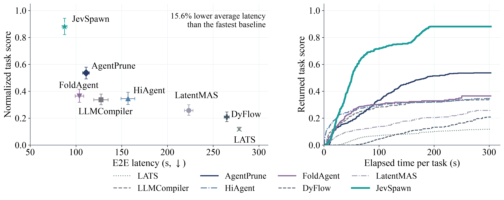
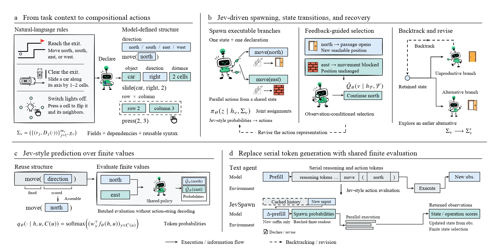

# JevSpawn: Adaptive Agentic Inference through Compositional Action Spaces



<p align="center">
  <a href="https://arxiv.org/abs/2610.00437"></a>
  <a href="https://hoyant-su.github.io/JevSpawn/"></a>
  <a href="https://github.com/Hoyant-Su/JevSpawn"></a>
  <a href="#citation"></a>
  <a href="https://huggingface.co/papers/2610.00437"></a>
</p>

LLM agents spend substantial time generating intermediate reasoning and actions token by token. Jev-style prediction offers a faster route through finite choices, but usually requires those choices to be defined in advance. **JevSpawn lets an agent infer and adapt its own compositional action space**, bringing finite probabilistic prediction to multi-turn interaction without additional training.

## What's New

- **2026-10-02** —  The [JevSpawn end-to-end demo](demo/README.md) is now available. [Watch the demo](https://github.com/user-attachments/assets/6a51df55-0d32-42fd-8568-9f0c09411d7d).
- **2026-10-01** —  The [JevSpawn preprint](https://arxiv.org/abs/2610.00437) is available on arXiv.
- **2026-10-01** —  JevSpawn is in research beta. Feedback, replications, and follow-up work are welcome through [GitHub issues](https://github.com/Hoyant-Su/JevSpawn/issues).
- **2026-09-30** —  The core algorithm and GPU inference runtime are open source in this repository.

## Method



JevSpawn connects natural-language task descriptions to **finite, executable action fields**. A small set of fields can express many actions through their combinations, while the representation can change as the agent learns from interaction.

1. **Construct the action space.** The model infers field meanings, possible values, dependencies, and shared action syntax from the task context. The declaration defines available interactions rather than an entire plan.
2. **Spawn and explore.** Conditional field probabilities are combined into joint action probabilities. A bounded beam selects distinct assignments, each of which is executed in an independent copy of the parent state. Observations guide further exploration, and retained branches allow backtracking. The model can revise the declaration when the current action space is insufficient.
3. **Share the computation.** Known value sequences are evaluated in batches, with output projection restricted to tokens that distinguish alternatives. Common context prefixes are reused across evaluations. Text generation supplies declarations, revisions, and final answers when needed. Repeated action exploration uses the finite policy.

The repository contains the core method and inference runtime, with the public entry point in [`src/jev_spawn/api.py`](src/jev_spawn/api.py) and shared experiment settings in [`configs/shared.yaml`](configs/shared.yaml).

## Demo

Follow the eight paper case studies through streamed declarations, spawned actions, observations, and final answers.

https://github.com/user-attachments/assets/6a51df55-0d32-42fd-8568-9f0c09411d7d

```bash
bash demo/run.sh
```

Open **http://127.0.0.1:8765** to replay the complete recorded traces without a GPU. [Demo instructions](demo/README.md) include fresh four-GPU inference and reproducible screen recording. The video shows recorded playback.

## Results

- **Tasks** — PPNL, Maze, Grid, LightsOut, RushHour, Sokoban, 2048, and Nullify.
- **Model** — Qwen3.8-27B.
- **TypeSafe Jev** — JevSpawn with API-based finite scoring.

### Task performance ↑

PPNL, Maze, and Grid report success rates on [0, 1]. Other columns report benchmark rewards or scores. **Bold** marks the best result and <ins>underlining</ins> marks the second best, including ties and the TypeSafe Jev variant.

| Method | PPNL | Maze | Grid | LightsOut | RushHour | Sokoban | 2048 | Nullify |
| :--- | ---: | ---: | ---: | ---: | ---: | ---: | ---: | ---: |
| LATS | 0.842 | 0.000 | 0.000 | 0.010 | 0.000 | 0.000 | 0.000 | 0.010 |
| LLMCompiler | 0.929 | 0.200 | 0.480 | 0.080 | 0.147 | <ins>0.350</ins> | 5.000 | 0.020 |
| AgentPrune | **0.956** | 0.280 | 0.280 | 0.340 | **0.453** | **0.790** | 1.240 | 0.030 |
| HiAgent | 0.930 | 0.400 | 0.320 | 0.033 | 0.172 | 0.140 | 0.000 | 0.090 |
| FoldAgent | 0.464 | <ins>0.520</ins> | 0.730 | 0.020 | 0.240 | 0.105 | 0.000 | 0.090 |
| DyFlow | 0.828 | 0.040 | 0.020 | 0.040 | 0.060 | 0.200 | 0.120 | 0.060 |
| LatentMAS | 0.902 | 0.320 | 0.120 | 0.030 | 0.113 | 0.095 | 0.000 | 0.050 |
| TypeSafe Jev | <ins>0.955</ins> | **0.960** | <ins>0.930</ins> | **0.660** | 0.290 | 0.250 | <ins>296.000</ins> | <ins>0.170</ins> |
| JevSpawn | 0.950 | **0.960** | **0.950** | <ins>0.610</ins> | <ins>0.390</ins> | 0.150 | **305.120** | **0.210** |

### E2E latency (seconds) ↓

Elapsed time is measured from task submission to termination, including failed tasks and timeouts. Lower latency should be read alongside task performance. API communication is included for TypeSafe Jev.

| Method | PPNL | Maze | Grid | LightsOut | RushHour | Sokoban | 2048 | Nullify |
| :--- | ---: | ---: | ---: | ---: | ---: | ---: | ---: | ---: |
| LATS | 131.34 | 300.00 | 300.00 | 299.01 | 298.57 | 300.00 | 300.00 | 298.18 |
| LLMCompiler | **13.61** | 235.32 | 117.16 | <ins>99.26</ins> | 223.42 | 123.99 | **33.51** | 172.85 |
| AgentPrune | 24.23 | <ins>47.91</ins> | 79.57 | 233.19 | 115.48 | 142.53 | 202.57 | **42.90** |
| HiAgent | <ins>16.25</ins> | 209.06 | 206.05 | 254.54 | **20.32** | 150.76 | 300.00 | 98.18 |
| FoldAgent | 43.55 | 191.69 | <ins>61.44</ins> | **84.17** | <ins>22.74</ins> | **78.32** | 300.07 | <ins>48.10</ins> |
| DyFlow | 125.47 | 285.43 | 269.57 | 294.18 | 289.03 | 280.57 | 287.35 | 287.37 |
| LatentMAS | 48.70 | 269.86 | 281.61 | 292.64 | 150.25 | 269.05 | 289.03 | 185.05 |
| TypeSafe Jev | 43.96 | 63.98 | 78.39 | 153.95 | 187.45 | 214.76 | 249.05 | 189.41 |
| JevSpawn | 21.88 | **40.91** | **40.58** | 111.05 | 89.20 | <ins>122.49</ins> | <ins>169.94</ins> | 104.21 |

## Citation

```bibtex
@misc{su2026jevspawnadaptiveagenticinference,
      title={JevSpawn: Adaptive Agentic Inference through Compositional Action Spaces},
      author={Haoyang Su and Weiran Huang},
      year={2026},
      eprint={2610.00437},
      archivePrefix={arXiv},
      primaryClass={cs.AI},
      url={https://arxiv.org/abs/2610.00437},
}
```
